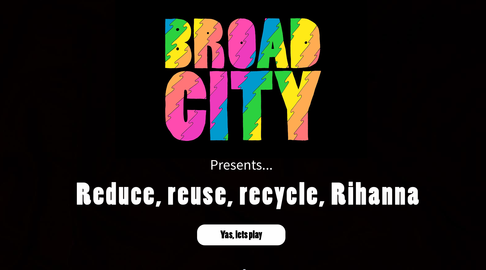
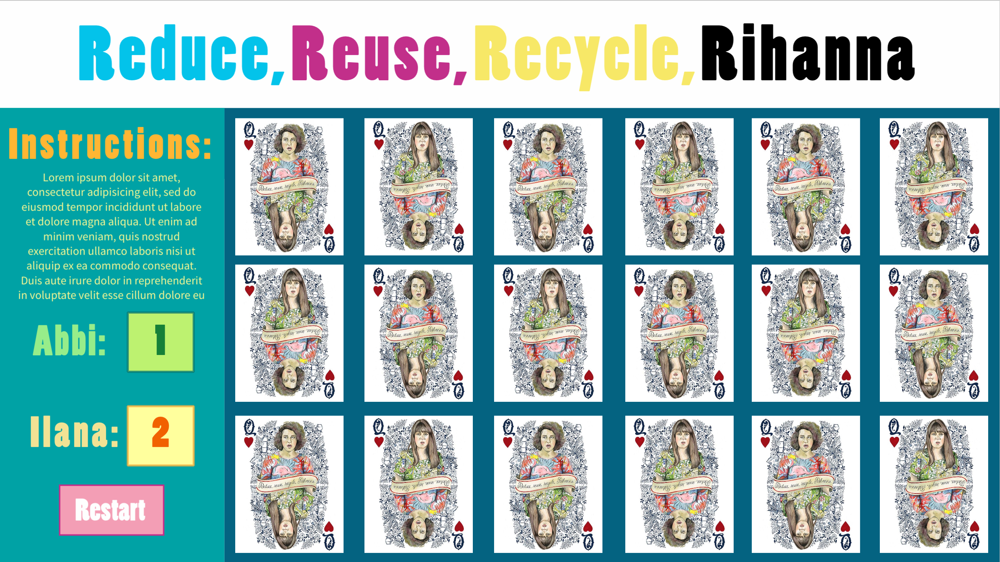

## Broad City Memory Game

### How to play
Very simple...
Player One = Abbi
Player Two = Ilana

You each take turns flipping two cards to check for a match. Player with the highest score gets a big ole' YAS Kween. Hit restart to play again.

## Trello Board

Link to trello board:
https://trello.com/b/639kxsCB

## Wireframe Landing Page

Landing page:

## Wireframe GamePlay

Game page:

## Idea

I felt when beginning this project I wanted to elaborate on the memory card game we flew through during the prework

My idea was to make the game bright and fun, much like the animation on the show, and bring it to the next level with fun animations and adding a second player

## Technology 

### Photoshop

I used photoshop to edit the photos and size them so both the card.png (the back of card) and the front would match sizes.

### HTML/CSS

I used basic HTML5 and CSS to gice the pages style. CSS was where I could really enhance the game from just a basic memory card game to something more fun and visually pleasing

### jQuery

I decided to go with jQuery to really differentiate from the original project we worked on and to push my skills further. I created all the cards dynamically through jQuery and stored them all in objects.

This allowed to me to manipulate them how i'd like and set a reset button to have them all scramble.

### Challenges

My challenges were mostly with the jquery and the addition of the second player. Suprisingly I thought resetting the board would be hard but after doing a little studying on the Fisher Yates shuffle and theory behind it. 

I finally decided on separating the players into two variables each with a funtion that added one point to their score (player one and two). After doing that I kept track of each matching click (couldnt use just every click because each turn gets two clicks) and then use the mod to see if it was player one or two and run the function that adds a score to each respecting mod.

